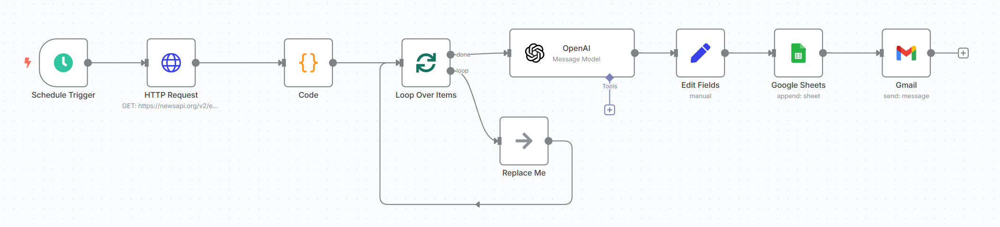

# 📰 AI News Summary Automation

This repository contains an automated workflow built using [n8n](https://n8n.io/) that fetches the latest news articles related to **Artificial Intelligence**, summarizes each article using **OpenAI GPT-3.5**, and stores the results in a **Google Sheet**. The workflow is triggered every 3 hours.

---

## 📌 Features

- ⏰ Automatically triggers every 3 hours
- 🌐 Uses NewsAPI to fetch AI-related news
- ✂️ Summarizes articles using OpenAI (GPT-3.5-turbo)
- 📊 Saves data to Google Sheets
- 🔁 Batch processing with dynamic looping

---

## 🧩 Workflow Overview



> Make sure to create a folder named `images/` and place your workflow screenshot as `workflow.png`.

---

## 🧪 Workflow Steps

1. **Cron Node** – Triggers every 3 hours.
2. **HTTP Request (NewsAPI)** – Fetches AI news using NewsAPI.
3. **Set Node** – Extracts relevant fields like title, description, source, and published date.
4. **SplitInBatches Node** – Loops through each news article.
5. **OpenAI Node** – Sends the title + description to GPT-3.5-turbo for a 2-line summary.
6. **Google Sheets Node** – Appends a row with:  
   - Title  
   - Summary  
   - Source Name  
   - Published At  
   - URL

---

## 🛠️ Requirements

- n8n (self-hosted or cloud)
- NewsAPI key — [Sign up here](https://newsapi.org/)
- OpenAI API key — [Get it here](https://platform.openai.com/)
- Google Sheets account with API connected in n8n

---

## 📁 Files

```bash
.
├── AI_news_summary.json      # Exported n8n workflow
├── images/
│   └── workflow.png          # Visual diagram of the workflow
└── README.md                 # You're here!
